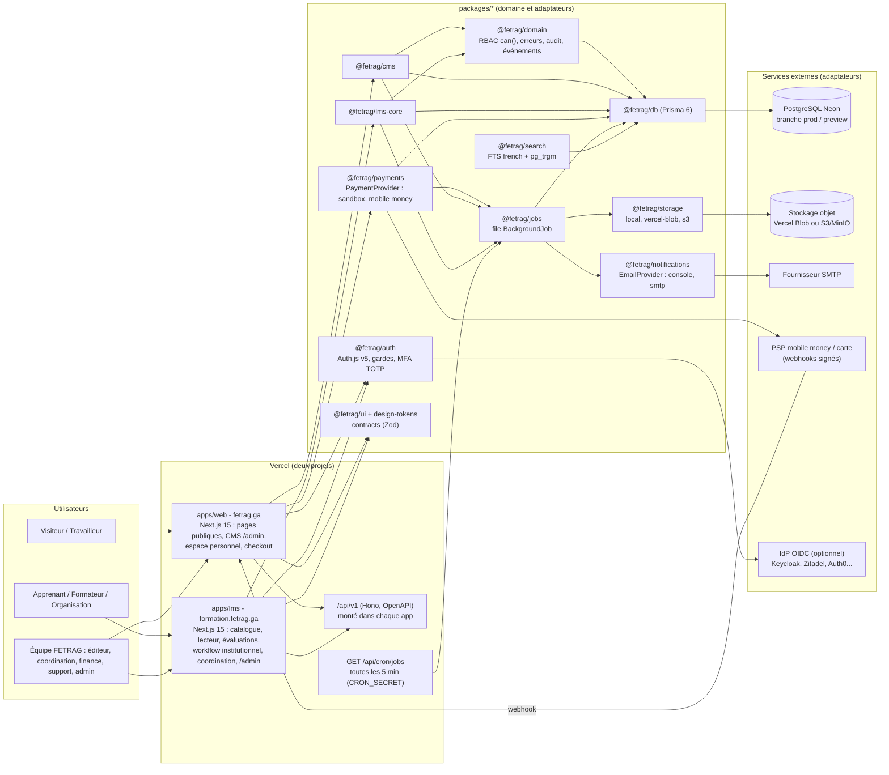
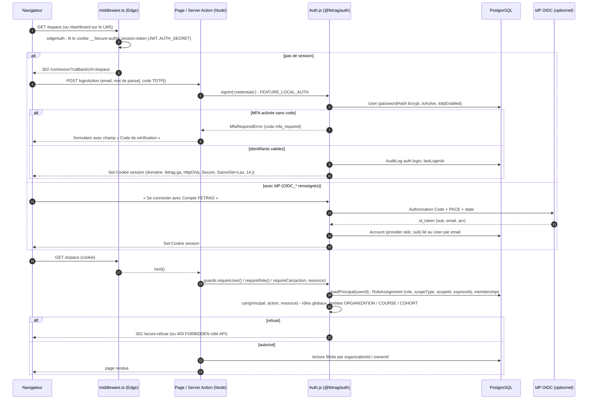
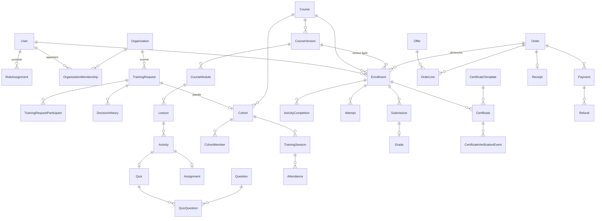

# Architecture de l'écosystème numérique FETRAG

Ce document décrit l'architecture réellement mise en œuvre dans le monorepo (version 0.1.0). Il complète le cahier des charges (`docs/specs/FETRAG_CDC_UNIFIE.md`, chapitres 6 à 8 et 16) et les décisions d'architecture (`docs/adr`). Là où le CDC proposait Fastify, Redis et BullMQ, les ADR-001 à 005 ont retenu des choix compatibles avec un hébergement Vercel + Neon : le résultat est décrit ici.

## 1. Vue d'ensemble

Deux applications Next.js 15 (App Router, React 19) partagent une base PostgreSQL (Neon), une identité (Auth.js v5), un design system et des packages de domaine. L'API REST `/api/v1` (Hono + Zod OpenAPI) est montée dans chaque application et peut être servie seule par `apps/api`. Les traitements asynchrones passent par une file de jobs persistée en PostgreSQL, déclenchée par un cron Vercel ou par `apps/worker`.



Points structurants :

- **Server Components par défaut** : les pages lisent les données en appelant les services des packages ; les mutations passent par des Server Actions (`'use server'`, validation Zod, gardes) ou par l'API. Aucun accès base depuis le navigateur.
- **Une seule identité** : session JWT Auth.js signée par `AUTH_SECRET` commun, cookie posé sur `.fetrag.ga` (SSO entre les deux domaines, ADR-002).
- **Adaptateurs** pour tout service externe (ADR-003) : le domaine ne connaît que des interfaces (`PaymentProvider`, `StorageProvider`, `EmailProvider`).
- **File de jobs PostgreSQL** (ADR-001) : jobs idempotents, verrouillage optimiste, backoff exponentiel, dead-letter `DEAD`.
- **Recherche PostgreSQL** (ADR-005) : `to_tsvector('french', unaccent(...))` + similarité trigram, contenus publiés uniquement.

## 2. Monorepo

```text
apps/web        Next.js - fetrag.ga (public, (auth), (account)/espace, admin, paiement, api/*)
apps/lms        Next.js - formation.fetrag.ga ((learner), (staff), (auth), api/*)
apps/api        Serveur Hono autonome (@hono/node-server) pour un hébergement conteneurisé
apps/worker     Boucle de traitement de la file de jobs (hors Vercel)
packages/
  design-tokens  couleurs, typographies, motion issus du logo (theme.css Tailwind v4)
  ui             design system « Le Cercle et l'Étoile » (Ribbon, ArcRing, Emblem, ModuleCard...)
  contracts      schémas Zod, enums miroirs + libellés FR, transitions, DTO partagés
  config         getEnv() validé par Zod, feature flags, constantes produit
  db             Prisma 6 + migrations + seed (10 modules, comptes démo, cours pilote)
  domain         erreurs, références, argent, slugs, dates, RBAC can(), audit, événements, pagination
  auth           Auth.js v5 (Credentials local + OIDC), gardes serveur, MFA TOTP, edge middleware
  observability  logger JSON caviardé, correlation id, health checks
  cms            pages, actualités, ressources, services, événements, menus, SEO, formulaires, publication
  lms-core       catalogue, builder, inscriptions, progression, quiz, devoirs, cohortes, présence,
                 demandes institutionnelles, certification, forums, rapports, dashboards, questionnaires
  payments       PaymentProvider + sandbox / airtel-money / moov-money, checkout, webhooks, rapprochement
  storage        StorageProvider + local / vercel-blob / s3, URL signées, validation d'upload
  notifications  sendEmail / notifyUser / notifyRole, templates FR, EmailDelivery rejouable
  jobs           enqueue / processJobs, handlers par défaut (email, certificat PDF, reçu, webhook...)
  search         recherche transverse PostgreSQL
  analytics      événements d'usage (utilisateur haché) et indicateurs des tableaux de bord
  api            routeur Hono /api/v1 (OpenAPI, auth cookie ou X-API-Key)
  testing        fabriques de principals, preset Vitest, tests E2E Playwright
  eslint-config, tsconfig
infra/          docker (Dockerfiles, compose), proxy (Caddy), deployment (options d'hébergement)
docs/           specs, adr, architecture, runbooks, guides, api
scripts/        check-no-emoji.mjs, export-data.ts (réversibilité), e2e.mjs (lanceur Playwright), backup.md
```

Sens des dépendances (`BUILD_BRIEF.md`, section 0bis) : apps → packages ; `jobs` → db, domain, config, notifications, storage, observability ; `notifications` → db, domain, config ; `payments` → db, domain, config, jobs, notifications ; `cms` et `lms-core` → db, domain, config, jobs, notifications, storage ; `api` → tout. Aucun package ne dépend d'une application, aucun cycle.

## 3. Flux d'authentification et d'autorisation



Règles :

- Le middleware ne vérifie que la **présence** d'une session (Edge, sans Prisma) ; identité + rôle + portée sont toujours contrôlés côté serveur par `createGuards(auth)` : `getPrincipal`, `requireUser`, `requireRole`, `requireCan`, `api.requireUser`, `api.requireCan`.
- `can(principal, action, resource)` (`packages/domain/src/rbac.ts`) centralise la politique : `SUPER_ADMIN` implicite partout, tableau `globalGrants` par action, `scopedGrants` pour les rôles limités (TRAINER sur un cours / une cohorte, ORG_MANAGER sur son organisation), responsable d'organisation reconnu par appartenance (`isManager`).
- MFA TOTP (`otplib`) pour SUPER_ADMIN, COORDINATOR, FINANCE, EDITOR (`mfaRequiredRoles`) ; avec un IdP, la MFA est déléguée (`acr`). L'application stricte au niveau des gardes est activée par `AUTH_ENFORCE_MFA=true`.
- L'API accepte la session Auth.js (cookie) ou une clé `X-API-Key` (`SystemSetting api.keys`) ; le principal est injecté par les applications (`c.set('principal', ...)`).

## 4. Modèle de données par domaine

Schéma : `packages/db/prisma/schema.prisma` (UUID, dates UTC, montants entiers XAF + code devise, `organizationId` filtrable). Enumérations miroirs et libellés dans `@fetrag/contracts`.

| Domaine | Modèles | Notes |
| --- | --- | --- |
| Identité | `User`, `Account`, `Session`, `VerificationToken`, `RoleAssignment`, `Consent`, `NotificationPreference` | `RoleAssignment(role, scopeType, scopeId, expiresAt)` ; `User.totpSecret`, `backupCodes` ; consentements horodatés (SHR-08) |
| Organisations | `Organization`, `OrganizationMembership`, `OrganizationContact` | `isManager` sur l'appartenance ; toutes les données organisationnelles filtrées par `organizationId` |
| CMS | `Category`, `Page`, `PageRevision`, `Article`, `Partner`, `Service`, `ServiceRequest`, `Resource`, `MediaAsset`, `Menu`, `MenuItem`, `SeoRecord`, `FormSubmission`, `NewsletterSubscription`, `Faq` | `ContentStatus` DRAFT → REVIEW → SCHEDULED/PUBLISHED → ARCHIVED ; `AccessLevel` PUBLIC / MEMBER / ORGANIZATION / PREMIUM ; HTML assaini |
| Catalogue de formation | `Course`, `CourseTrainer`, `Prerequisite`, `CourseVersion`, `CourseModule`, `Lesson`, `Activity` | `Course.currentVersionId` ; `CourseVersion.completionRules` (JSON validé) ; `Activity.completionRule`, `lowBandwidthAlternative` |
| Apprentissage | `Enrollment`, `ActivityCompletion`, `Quiz`, `Question`, `QuestionOption`, `QuizQuestion`, `Attempt`, `Answer`, `Assignment`, `Submission`, `Grade` | Inscription liée à une **version** ; `ActivityCompletion` unique par inscription + activité (idempotence) ; banque de questions réutilisable |
| Sessions | `Cohort`, `CohortMember`, `TrainingSession`, `Attendance`, `LiveSession` | Cohorte privée par organisation ; présence par session (`PRESENT`, `ABSENT`, `LATE`, `EXCUSED`) |
| Workflow institutionnel | `TrainingRequest`, `TrainingRequestModule`, `TrainingRequestParticipant`, `Attachment`, `DecisionHistory`, `StatusEvent` | Statuts et transitions dans `trainingRequestTransitions` ; `participantLimit` paramétrable |
| Certification | `CertificateTemplate`, `Certificate`, `CertificateVerificationEvent` | Numéro `FETRAG-AAAA-NNNNNN` unique, `verifyCode`, `status` ISSUED / REVOKED / EXPIRED, PDF dans le stockage privé |
| Commerce | `Offer`, `Coupon`, `Sponsorship`, `Order`, `OrderLine`, `Payment`, `Refund`, `Receipt` | `Order.reference` `CMD-AAAA-XXXXXX` ; `Payment.provider` + `providerRef` ; montants entiers |
| Événements | `Event`, `EventRegistration`, `WaitingListEntry` | Jauge, liste d'attente, offre payante optionnelle |
| Communication | `Notification`, `EmailDelivery`, `EmailTemplate`, `Forum`, `ForumThread`, `ForumPost` | `EmailDelivery` rejouable ; forums par cours ou cohorte, modérés |
| Exploitation | `AuditLog`, `WebhookEvent`, `BackgroundJob`, `SystemSetting`, `AnalyticsEvent` | Audit immuable (IP hachée) ; webhooks uniques par `provider + externalId` ; jobs avec `idempotencyKey`, `lockedAt/lockedBy` |



## 5. Flux métier clés

| Flux | Chemin | Exigences |
| --- | --- | --- |
| Publication éditoriale | `/admin` → `cms.publishing.transition(entity, id, toStatus, principal)` → audit `content.published` → événement `content.published` ; `SCHEDULED` résolu par le job `content.publish-scheduled` | WEB-02, WEB-18 |
| Catalogue synchronisé | `Course.status = PUBLISHED` + version courante → `catalog.listPublished` alimente `/formations` (vitrine) et `/catalogue` (LMS) | WEB-04, LMS-01 |
| Demande institutionnelle | `/demande-formation` → `trainingRequests.create` (DRAFT → SUBMITTED) → `/coordination` → `trainingRequests.decide` (transitions contrôlées, `DecisionHistory`) → `SCHEDULED` crée cohorte + comptes + inscriptions + convocations | LMS-05, chapitre 14 |
| Apprentissage | `/apprendre/[courseId]/[lessonId]` → `progress.report` (idempotent, recalcul `progressPercent`, `course.completed`) ; `/evaluations/[activityId]` → `quizzes.start` / `submit` (correction automatique sauf composition) ; `/devoirs` → `assignments.submit` / `grade` | LMS-02, LMS-03, LMS-19, LMS-22 |
| Certification | `certification.checkEligibility` → `issue` (numéro séquentiel, `verifyCode`) → job `certificate.render` (pdf-lib + QR, stockage privé) → `/certificats/verifier/[code]` (`certification.verify`, journalisée) | LMS-07, WEB-16 |
| Paiement | `createCheckout` (idempotent) → `PaymentProvider.createPayment` → webhook `processWebhook` (signature, `WebhookEvent`) → job `webhook.process` → `confirmPayment` (transaction) → `fulfillOrder` (inscription, événement, service) → `receipt.render` + email ; `reconcile()` rattrape les webhooks perdus | WEB-08, SHR-06 |
| Notifications | `notifyUser` / `notifyRole` (interne + email optionnel) ; `sendEmail` → `EmailDelivery` → tentative immédiate → job `email.send` rejouable ; consentement vérifié pour le marketing | SHR-05, SHR-08, LMS-11 |
| Recherche | `/recherche` → `searchPublic(q, { types, limit })` (SQL brut, publiés uniquement) | WEB-07, SHR-09 |

## 6. Exécution et environnements

- **Vercel** : deux projets (`apps/web`, `apps/lms`) avec Root Directory ; build `pnpm install` (génère Prisma) puis `next build` ; cron `*/5 * * * *` sur `/api/cron/jobs` ; variables d'environnement chiffrées ; `AUTH_COOKIE_DOMAIN=.fetrag.ga` en production.
- **Docker** (`infra/docker`) : images `Dockerfile.next` (web, lms, sortie `standalone`) et `Dockerfile.node` (api, worker via `tsx`), `docker-compose.yml` avec PostgreSQL 16, MinIO, Mailpit, Caddy (TLS automatique, en-têtes de sécurité). Voir `docs/runbooks/deploiement.md` et `infra/deployment/README.md`.
- **Configuration** : `getEnv()` (`@fetrag/config`) valide les variables au démarrage ; `.env.example` documente les familles (base, auth, OIDC, URL, email, stockage, paiement, cron, feature flags).
- **Observabilité** : logs JSON caviardés (`@fetrag/observability`), `correlationId` de bout en bout, `/api/health` par application, supervision décrite dans `docs/runbooks/supervision.md`.

## 7. Design system

`packages/design-tokens` (couleurs bleu `#0259C7`, vert `#9CC102`, or `#F9C804`, marine `#042768` ; Fraunces pour les titres, Manrope pour l'interface) et `packages/ui` (« Le Cercle et l'Étoile » : `Ribbon`, `ArcRing`, `Emblem`, `RingBackdrop`, `PillarCard`, `ModuleCard` 01-10, `StatTile`, `CertificateSeal`, `TriptychStrip`, `MottoStrip`, animations `Reveal`, `Stagger`, `Counter`, `Marquee` avec respect de `prefers-reduced-motion`). Référence : `docs/architecture/DESIGN_SYSTEM.md`. Aucun emoji ; icônes `lucide-react` ; WCAG 2.2 AA ; mobile-first.

## 8. Évolutions prévues et limites connues

- Bascule vers l'IdP OIDC définitif (ADR-002) : configuration + rapprochement des comptes par email ; désactivation de `FEATURE_LOCAL_AUTH`.
- Adaptateurs PSP réels (Airtel Money, Moov Money) : squelettes présents, à finaliser avec les identifiants du prestataire (ADR-003).
- Limiteur de débit **en mémoire** par instance (`checkRateLimit`) : suffisant en V1, à remplacer par un compteur partagé (PostgreSQL ou Redis) si la volumétrie l'exige.
- File de jobs bornée par la fréquence du cron (5 minutes, 25 jobs par appel sur Vercel) : `apps/worker` en complément si nécessaire ; Redis/BullMQ reste possible derrière la même interface `enqueue`.
- Multilingue : structure prête (`Locale`, dictionnaire `fr`), routage `/[locale]` non activé.
- Détail des exigences livrées, partielles ou reportées : `docs/BACKLOG.md`.
